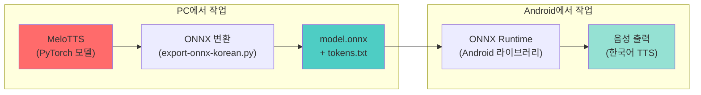
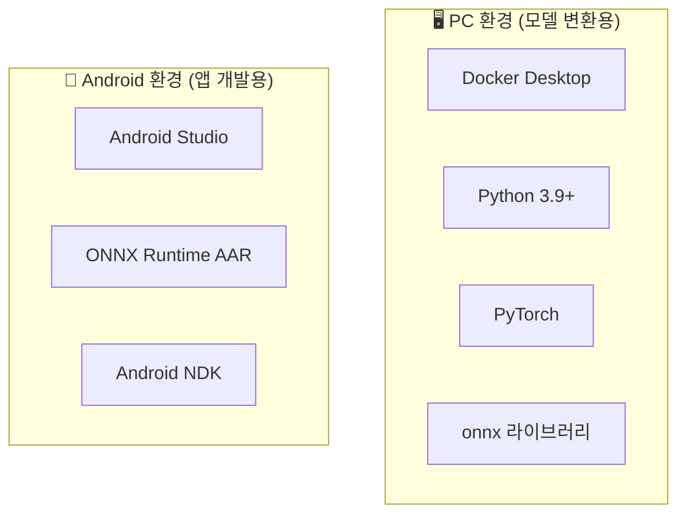
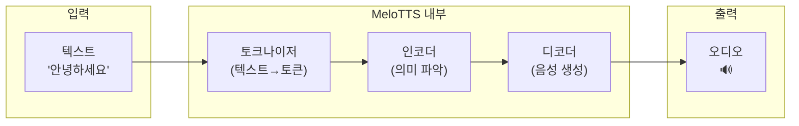
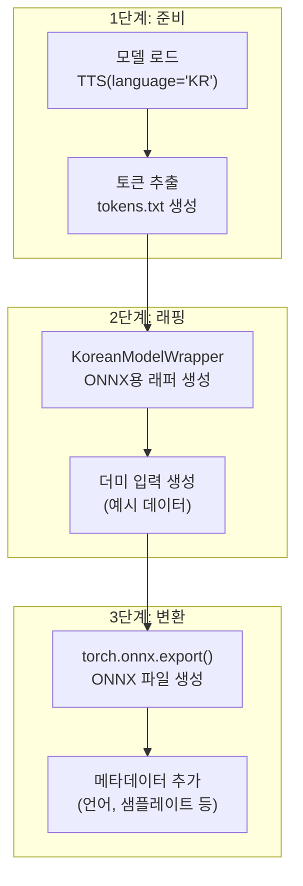
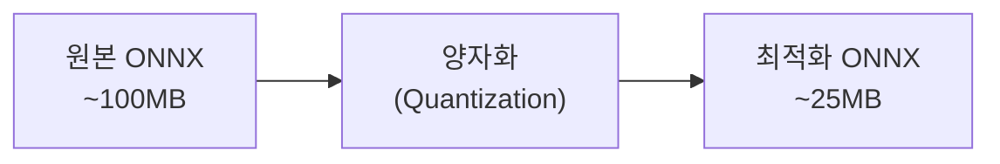

# 🎙️ 한국어 MeloTTS → ONNX → Android 배포 완벽 가이드

> 머신러닝 초보자를 위한 단계별 상세 설명서

---

## 📋 목차

1. [전체 프로세스 개요](#1-전체-프로세스-개요)
2. [핵심 개념 및 용어 설명](#2-핵심-개념-및-용어-설명)
3. [Step 1: 환경 준비](#step-1-환경-준비)
4. [Step 2: MeloTTS 모델 이해하기](#step-2-melotts-모델-이해하기)
5. [Step 3: ONNX 변환하기](#step-3-onnx-변환하기)
6. [Step 4: Android 앱 개발](#step-4-android-앱-개발)
7. [Step 5: 최적화 및 배포](#step-5-최적화-및-배포)
8. [문제 해결 가이드](#문제-해결-가이드)

---

## 1. 전체 프로세스 개요



### 왜 이런 과정이 필요한가?

| 단계 | 이유 |
|------|------|
| PyTorch → ONNX | PyTorch는 PC용, ONNX는 범용 포맷으로 모바일에서 실행 가능 |
| ONNX → Android | ONNX Runtime이 Android에서 효율적으로 AI 모델 실행 |

---

## 2. 핵심 개념 및 용어 설명

### 🔤 기본 용어 사전

#### TTS (Text-to-Speech)
```
텍스트 → [AI 모델] → 음성
"안녕하세요" → [MeloTTS] → 🔊 "안녕하세요" (소리)
```
- 문자를 사람 음성으로 변환하는 기술
- MeloTTS는 한국어를 포함한 다국어 TTS 모델

#### PyTorch
- Facebook(Meta)이 만든 딥러닝 프레임워크
- **비유**: 요리할 때 사용하는 "주방"
- MeloTTS 모델이 PyTorch로 만들어져 있음
- 문제점: Android에서 직접 실행 불가

#### ONNX (Open Neural Network Exchange)
```
PyTorch 모델 → [ONNX 변환] → .onnx 파일
TensorFlow 모델 → [ONNX 변환] → .onnx 파일
```
- AI 모델의 "공용 언어" 같은 것
- **비유**: 다양한 언어로 된 요리책을 "영어"로 번역하는 것
- 한 번 ONNX로 변환하면 어디서든 실행 가능

#### ONNX Runtime
- ONNX 파일을 실행하는 프로그램
- Android, iOS, Windows, Linux 등에서 모두 동작
- **비유**: ONNX 파일(요리책)을 읽고 실제로 요리하는 "셰프"

#### 추론 (Inference)
```
입력 → [학습된 모델] → 출력
"안녕" → [MeloTTS] → 음성 데이터
```
- 이미 학습된 모델을 사용해 결과를 얻는 것
- 학습(Training)과 반대 개념
- 우리가 하는 것: 추론만 (학습은 이미 완료됨)

---

### 🧠 MeloTTS 관련 용어

#### 토큰 (Token)
```python
"안녕하세요" → ["ㅇ", "ㅏ", "ㄴ", "ㄴ", "ㅕ", "ㅇ", ...] → [0, 3, 1, 1, 5, 0, ...]
     텍스트        →        음소 분해        →        숫자 ID
```
- AI는 문자를 직접 이해하지 못함
- 문자를 숫자로 변환해야 함
- `tokens.txt` 파일이 이 변환표 역할

#### 화자 ID (Speaker ID)
- 어떤 목소리로 읽을지 선택
- MeloTTS 한국어는 보통 1명의 화자만 있음 (sid=0)

#### 샘플레이트 (Sample Rate)
```
44100 Hz = 1초에 44,100개의 소리 샘플
```
- 소리의 해상도
- MeloTTS 한국어는 보통 44100 Hz 사용

#### BERT 임베딩
- 텍스트의 의미를 숫자 벡터로 표현한 것
- 더 자연스러운 음성을 위해 사용
- ONNX 변환 시 생략 가능 (품질 약간 저하)

---

### 📦 파일 형식 설명

| 파일 | 설명 | 크기 (예상) |
|------|------|------------|
| `model.onnx` | ONNX 변환된 TTS 모델 | ~100MB |
| `tokens.txt` | 토큰 사전 (텍스트→숫자 변환표) | ~5KB |

---

## Step 1: 환경 준비

### 1.1 필요한 도구들



### 1.2 Docker 환경 설정

> [!NOTE]
> Docker를 사용하는 이유: MeloTTS는 여러 복잡한 의존성이 있어 Docker로 환경을 격리하면 설치가 쉬움

**현재 Dockerfile 분석:**
```dockerfile
# 기본 이미지 (Python + PyTorch 포함)
FROM pytorch/pytorch:latest

# MeloTTS 설치
RUN pip install -e .
```

**Docker 빌드 명령어:**
```bash
# 이미지 빌드 (현재 실행 중)
docker build -t melotts .

# 컨테이너 실행
docker run -it --rm -v ${PWD}:/workspace melotts bash
```

### 1.3 프로젝트 구조

```
MeloTTS/
├── melo/                    # MeloTTS 핵심 코드
│   ├── api.py              # TTS API
│   └── text/               # 텍스트 처리
├── export-onnx-korean.py   # ⭐ ONNX 변환 스크립트
├── Dockerfile              # Docker 설정
└── requirements.txt        # Python 의존성
```

---

## Step 2: MeloTTS 모델 이해하기

### 2.1 MeloTTS 작동 원리



### 2.2 주요 파라미터

| 파라미터 | 설명 | 기본값 | 효과 |
|----------|------|--------|------|
| `noise_scale` | 음성 변화량 | 1.0 | 높을수록 다양한 억양 |
| `length_scale` | 말하기 속도 | 1.0 | 낮을수록 빨리 말함 |
| `noise_scale_w` | 추가 노이즈 | 1.0 | 음성 자연스러움 조절 |
| `sid` | 화자 ID | 0 | 목소리 선택 |

---

## Step 3: ONNX 변환하기

### 3.1 변환 스크립트 흐름



### 3.2 핵심 코드 분석

#### 토큰 생성

```python
def generate_tokens(symbol_list):
    """
    tokens.txt 생성
    예시:
        <pad> 0
        ㄱ 1
        ㄴ 2
    """
    with open("tokens.txt", "w", encoding="utf-8") as f:
        for i, s in enumerate(symbol_list):
            f.write(f"{s} {i}\n")
```

#### 모델 래퍼 (가장 중요!)

```python
class KoreanModelWrapper(torch.nn.Module):
    """
    왜 래퍼가 필요한가?
    - MeloTTS는 복잡한 입력 필요 (BERT 등)
    - ONNX는 단순한 입력만 처리 가능
    - 래퍼가 중간에서 변환 역할
    """
    
    def forward(self, x, x_lengths, tones, sid, ...):
        # BERT를 0으로 단순화 (품질 약간 저하)
        bert = torch.zeros(...)
        
        # 실제 모델 호출
        return self.model.model.infer(...)
```

#### ONNX 내보내기

```python
torch.onnx.export(
    torch_model,           # 변환할 모델
    (x, x_lengths, ...),   # 예시 입력
    "model.onnx",          # 출력 파일
    opset_version=18,      # ONNX 버전
    input_names=[...],     # 입력 이름 정의
    output_names=["y"],    # 출력 이름 정의
    dynamic_axes={...},    # 가변 크기 허용
)
```

### 3.3 변환 실행

```bash
# Docker 컨테이너 내에서
python export-onnx-korean.py
```

**예상 출력:**
```
==================================================
MeloTTS 한국어 → ONNX 변환
==================================================

📥 한국어 모델 로딩...
   샘플레이트: 44100
✅ tokens.txt 생성 완료 (XXX개 토큰)

📦 ONNX 변환 중...

==================================================
✅ 변환 완료!
==================================================

생성된 파일: model.onnx, tokens.txt
```

---

## Step 4: Android 앱 개발

### 4.1 프로젝트 구조

```
android-tts-app/
├── app/
│   ├── src/main/
│   │   ├── java/.../
│   │   │   ├── MainActivity.kt
│   │   │   ├── TTSEngine.kt      # ONNX 모델 실행
│   │   │   └── Tokenizer.kt      # 텍스트→토큰 변환
│   │   ├── assets/
│   │   │   ├── model.onnx        # ⭐ 변환된 모델
│   │   │   └── tokens.txt        # ⭐ 토큰 사전
│   │   └── res/
│   └── build.gradle.kts
└── build.gradle.kts
```

### 4.2 Gradle 의존성

```kotlin
// app/build.gradle.kts
dependencies {
    // ONNX Runtime for Android
    implementation("com.microsoft.onnxruntime:onnxruntime-android:1.16.3")
    
    // 오디오 재생용
    implementation("androidx.media:media:1.6.0")
}
```

### 4.3 핵심 코드: TTSEngine

```kotlin
class TTSEngine(context: Context) {
    private lateinit var ortSession: OrtSession
    private lateinit var tokenMap: Map<String, Int>
    
    init {
        // 1. ONNX 모델 로드
        val env = OrtEnvironment.getEnvironment()
        val modelBytes = context.assets.open("model.onnx").readBytes()
        ortSession = env.createSession(modelBytes)
        
        // 2. 토큰 사전 로드
        tokenMap = loadTokens(context)
    }
    
    fun textToSpeech(text: String): FloatArray {
        // 3. 텍스트 → 토큰 변환
        val tokens = tokenize(text)
        
        // 4. ONNX 모델 실행
        val inputs = mapOf(
            "x" to OnnxTensor.createTensor(env, tokens),
            "x_lengths" to OnnxTensor.createTensor(env, intArrayOf(tokens.size)),
            // ... 나머지 입력들
        )
        
        val output = ortSession.run(inputs)
        return output["y"].value as FloatArray
    }
    
    private fun tokenize(text: String): IntArray {
        // 한글 → 음소 분해 → 토큰 ID
        // 이 부분은 추가 구현 필요
    }
}
```

> [!IMPORTANT]
> **한글 토크나이저 구현 필요**
> 
> MeloTTS의 Python 토크나이저를 Kotlin으로 포팅해야 합니다.
> 이 부분이 가장 복잡한 작업입니다.

### 4.4 오디오 재생

```kotlin
class AudioPlayer {
    private val sampleRate = 44100
    
    fun play(audioData: FloatArray) {
        val audioTrack = AudioTrack.Builder()
            .setAudioAttributes(...)
            .setAudioFormat(
                AudioFormat.Builder()
                    .setSampleRate(sampleRate)
                    .setEncoding(AudioFormat.ENCODING_PCM_FLOAT)
                    .build()
            )
            .build()
        
        audioTrack.write(audioData, 0, audioData.size, WRITE_BLOCKING)
        audioTrack.play()
    }
}
```

---

## Step 5: 최적화 및 배포

### 5.1 모델 크기 최적화



**양자화 스크립트:**
```python
from onnxruntime.quantization import quantize_dynamic, QuantType

quantize_dynamic(
    model_input="model.onnx",
    model_output="model_quantized.onnx",
    weight_type=QuantType.QUInt8
)
```

### 5.2 성능 최적화 팁

| 최적화 방법 | 효과 | 난이도 |
|------------|------|--------|
| 양자화 (Quantization) | 모델 크기 4배 감소, 속도 2배 향상 | ⭐⭐ |
| NNAPI 사용 | GPU 가속, 속도 3배 이상 향상 | ⭐⭐⭐ |
| 모델 분할 | 메모리 사용량 감소 | ⭐⭐⭐⭐ |

### 5.3 Android에서 NNAPI 사용

```kotlin
val sessionOptions = OrtSession.SessionOptions()
sessionOptions.addNnapi()  // NNAPI 가속 활성화

val session = env.createSession(modelBytes, sessionOptions)
```

---

## 문제 해결 가이드

### ❌ 일반적인 오류들

#### 1. "Out of Memory" 오류
```
해결: 
- 양자화된 모델 사용
- largeHeap 설정 추가 (AndroidManifest.xml)
```

```xml
<application
    android:largeHeap="true"
    ...>
```

#### 2. "Unsupported ONNX opset version"
```
해결:
- ONNX Runtime 버전 업그레이드
- 또는 변환 시 opset_version 낮추기
```

#### 3. 음성이 이상하게 나옴
```
가능한 원인:
- 토크나이저 구현 오류
- 샘플레이트 불일치
- 파라미터 값 문제
```

---

## 📚 참고 자료

- [MeloTTS GitHub](https://github.com/myshell-ai/MeloTTS)
- [ONNX Runtime Android 문서](https://onnxruntime.ai/docs/get-started/with-java.html)
- [PyTorch ONNX Export 가이드](https://pytorch.org/tutorials/advanced/super_resolution_with_onnxruntime.html)

---

## ✅ 체크리스트

- [ ] Docker 환경 준비
- [ ] MeloTTS 모델 ONNX 변환
- [ ] Android 프로젝트 생성
- [ ] ONNX Runtime 연동
- [ ] 한글 토크나이저 구현
- [ ] 오디오 재생 구현
- [ ] 모델 최적화 (양자화)
- [ ] 테스트 및 배포

---

> 📝 **마지막 업데이트**: 2024-12-22
