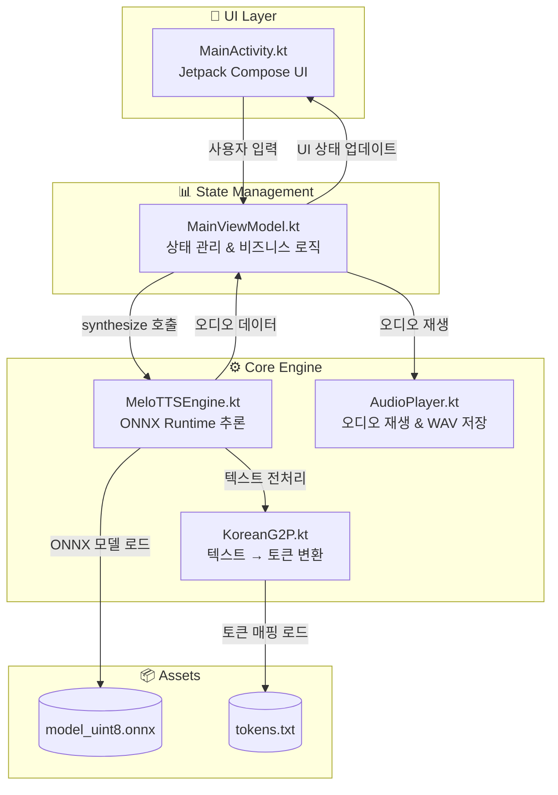
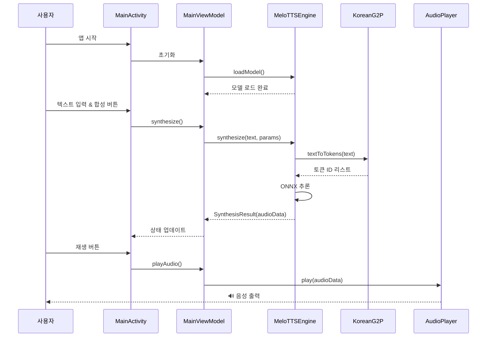
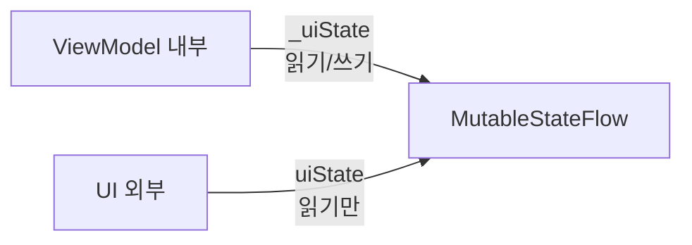
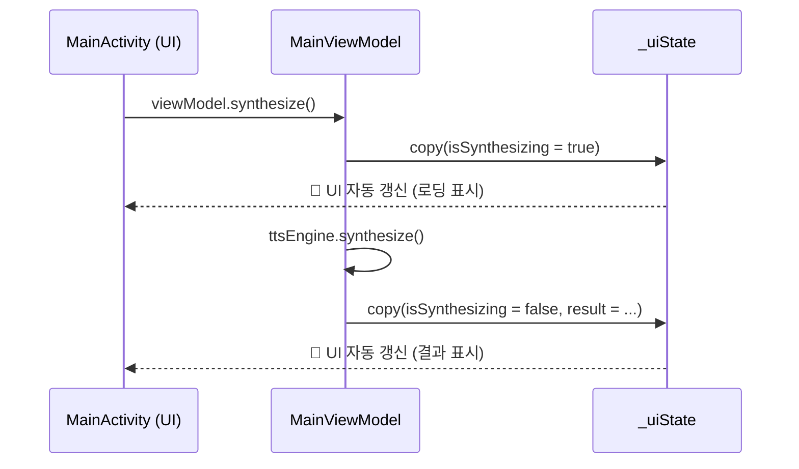

# MeloTTS Android 앱 탑다운 분석

MeloTTS Android 앱의 전체 구조를 탑다운 방식으로 분석한 문서입니다.

---

## 📁 프로젝트 폴더 구조

```
MeloTTS/
├── app/src/main/
│   ├── java/com/example/melotts/    # 📌 핵심 Kotlin 코드
│   │   ├── MainActivity.kt          # UI 레이어 (Jetpack Compose)
│   │   ├── MainViewModel.kt         # 상태 관리 (ViewModel)
│   │   ├── MeloTTSEngine.kt         # TTS 엔진 (ONNX 추론)
│   │   ├── AudioPlayer.kt           # 오디오 재생/저장
│   │   ├── KoreanG2P.kt             # 한글→음소 변환
│   │   └── ui/theme/                # 테마 설정
│   └── assets/                       # 앱 리소스
│       ├── model_uint8.onnx         # TTS 모델 (~51MB)
│       └── tokens.txt               # 토큰 매핑 파일
├── build.gradle.kts                  # Gradle 설정
└── ...
```

---

## 🔄 앱 데이터 흐름 (Top-Down)



---

## 📂 핵심 파일별 역할

### 1️⃣ [MainActivity.kt](file:///c:/Users/kal02/AndroidStudioProjects/MeloTTS/app/src/main/java/com/example/melotts/MainActivity.kt)

**역할**: UI 레이어 - Jetpack Compose로 사용자 인터페이스 구성

| 컴포넌트            | 설명                                     |
| ------------------- | ---------------------------------------- |
| `TTSScreen`         | 메인 화면 Composable                     |
| `ModelStatusCard`   | 모델 로딩 상태 표시                      |
| `ParameterControls` | noiseScale, lengthScale 등 파라미터 조절 |
| `MetricsCard`       | 합성 결과 메트릭 표시                    |

---

### 2️⃣ [MainViewModel.kt](file:///c:/Users/kal02/AndroidStudioProjects/MeloTTS/app/src/main/java/com/example/melotts/MainViewModel.kt)

**역할**: 상태 관리 & 비즈니스 로직

```kotlin
class MainViewModel(application: Application) : AndroidViewModel(application) {
    private val ttsEngine = MeloTTSEngine(application)  // TTS 엔진
    private val audioPlayer = AudioPlayer()              // 오디오 플레이어

    // 핵심 메서드
    fun loadModel()     // 모델 로드
    fun synthesize()    // 음성 합성
    fun playAudio()     // 재생
    fun stopAudio()     // 정지
    fun saveToWav()     // WAV 저장
}
```

**상태 관리** (`TTSUiState`):

- `isModelLoading` / `isModelLoaded`: 모델 로딩 상태
- `isSynthesizing`: 합성 중 여부
- `isPlaying`: 재생 중 여부
- `noiseScale`, `lengthScale`, `noiseScaleW`, `speakerId`: 조절 파라미터

---

### 3️⃣ [MeloTTSEngine.kt](file:///c:/Users/kal02/AndroidStudioProjects/MeloTTS/app/src/main/java/com/example/melotts/MeloTTSEngine.kt)

**역할**: ONNX Runtime을 이용한 TTS 추론 엔진

| 메서드         | 설명                             |
| -------------- | -------------------------------- |
| `loadModel()`  | assets에서 ONNX 모델 & 토큰 로드 |
| `synthesize()` | 텍스트 → 음성 변환 (핵심!)       |
| `close()`      | 리소스 해제                      |

**synthesize 흐름**:

1. `KoreanG2P.textToTokens()`로 텍스트 → 토큰 ID 변환
2. ONNX 모델에 토큰 입력
3. 오디오 파형(FloatArray) 출력

---

### 4️⃣ [KoreanG2P.kt](file:///c:/Users/kal02/AndroidStudioProjects/MeloTTS/app/src/main/java/com/example/melotts/KoreanG2P.kt)

**역할**: 한국어 Grapheme-to-Phoneme 변환

**처리 순서**:

1. `normalizeText()`: 영어/숫자 → 한국어 변환
2. `decomposeHangul()`: 한글 음절 → 자모 분리 (ㅎ+ㅏ+ㄴ)
3. `textToTokens()`: 자모 → 토큰 ID 매핑

```kotlin
// 예시: "안녕" → 자모 분리 → 토큰 ID 리스트
"안녕" → "ㅇㅏㄴㄴㅕㅇ" → [토큰IDs...]
```

---

### 5️⃣ [AudioPlayer.kt](file:///c:/Users/kal02/AndroidStudioProjects/MeloTTS/app/src/main/java/com/example/melotts/AudioPlayer.kt)

**역할**: PCM 오디오 재생 및 WAV 파일 저장

| 메서드        | 설명                                                   |
| ------------- | ------------------------------------------------------ |
| `play()`      | Float 오디오 → Int16 PCM 변환 후 `AudioTrack`으로 재생 |
| `stop()`      | 재생 중지                                              |
| `saveToWav()` | Float 오디오 → WAV 파일로 저장                         |

---

## 🎯 전체 실행 흐름



---

## 📊 각 파일의 크기 & 복잡도

| 파일             | 라인 수 | 역할        | 복잡도 |
| ---------------- | ------- | ----------- | ------ |
| MainActivity.kt  | 423     | UI 컴포넌트 | ⭐⭐   |
| MainViewModel.kt | 154     | 상태 관리   | ⭐     |
| MeloTTSEngine.kt | 255     | ONNX 추론   | ⭐⭐⭐ |
| KoreanG2P.kt     | 313     | 한글 처리   | ⭐⭐⭐ |
| AudioPlayer.kt   | 142     | 오디오 처리 | ⭐⭐   |

---

## 💡 코드 이해를 위한 권장 순서

1. **MainViewModel.kt** → 전체 흐름 파악 (가장 간단)
2. **MeloTTSEngine.kt** → TTS 추론 과정 이해
3. **KoreanG2P.kt** → 한글 처리 세부 로직
4. **MainActivity.kt** → UI 구조 파악
5. **AudioPlayer.kt** → 오디오 재생 기술

---

## 🔗 핵심 의존성

- **ONNX Runtime**: `ai.onnxruntime` - 모델 추론
- **Jetpack Compose**: UI 구성
- **Android AudioTrack**: 오디오 재생
- **Kotlin Coroutines**: 비동기 처리

---

# 🔍 MainViewModel.kt 상세 분석 (Kotlin/ViewModel 초보자용)

Kotlin과 ViewModel을 처음 접하는 분들을 위한 상세 설명입니다.

---

## 🎓 ViewModel이란?

**ViewModel**은 Android의 **MVVM 패턴** 핵심 구성요소입니다.

```
┌─────────────┐     ┌─────────────┐     ┌─────────────┐
│    View     │ ←── │  ViewModel  │ ←── │    Model    │
│ (UI/액티비티)│     │ (상태 관리)  │     │ (데이터/비즈니스)│
└─────────────┘     └─────────────┘     └─────────────┘
```

**왜 ViewModel이 필요한가?**
- 화면 회전 시에도 데이터 유지
- UI 로직과 비즈니스 로직 분리
- 테스트 용이성

---

## 📖 코드 라인별 상세 설명

### 1️⃣ Import 문 (1-12줄)

```kotlin
import androidx.lifecycle.AndroidViewModel   // ViewModel 기본 클래스
import androidx.lifecycle.viewModelScope     // ViewModel 전용 코루틴 스코프
import kotlinx.coroutines.flow.StateFlow     // 상태 관찰용 Flow
import kotlinx.coroutines.Dispatchers        // 스레드 지정 (IO, Main 등)
```

| 키워드 | Java 비유 | 설명 |
|--------|----------|------|
| `AndroidViewModel` | - | Context 접근이 필요한 ViewModel |
| `StateFlow` | LiveData | 상태 변화를 관찰 |
| `viewModelScope` | ExecutorService | ViewModel 수명주기에 맞춘 비동기 스코프 |
| `Dispatchers.IO` | Executors.newIO... | I/O 작업용 스레드 |

---

### 2️⃣ TTSUiState - 상태 데이터 클래스 (15-29줄)

```kotlin
data class TTSUiState(
    val isModelLoading: Boolean = false,    // 모델 로딩 중?
    val isModelLoaded: Boolean = false,     // 모델 로드 완료?
    val isSynthesizing: Boolean = false,    // 합성 중?
    val isPlaying: Boolean = false,         // 재생 중?
    val synthesisResult: SynthesisResult? = null,  // 합성 결과
    val error: String? = null,              // 에러 메시지
    
    // TTS 파라미터
    val noiseScale: Float = 0.667f,
    val lengthScale: Float = 1.0f,
    val noiseScaleW: Float = 0.8f,
    val speakerId: Long = 0L,
    val inputText: String = "안녕하세요. 반갑습니다."
)
```

**`data class`란?**
```kotlin
// Kotlin의 data class
data class TTSUiState(val isLoading: Boolean)

// 위 한 줄이 Java로는 이렇게 됨:
public class TTSUiState {
    private final boolean isLoading;
    public TTSUiState(boolean isLoading) { this.isLoading = isLoading; }
    public boolean isLoading() { return isLoading; }
    public boolean equals(Object o) { ... }
    public int hashCode() { ... }
    public String toString() { ... }
    public TTSUiState copy(boolean isLoading) { ... }  // ⭐ 핵심!
}
```

**`= false` 기본값?**
- Kotlin 함수/생성자 파라미터에 기본값 지정 가능
- `TTSUiState()` 호출시 모든 값이 기본값으로 초기화

---

### 3️⃣ MainViewModel 클래스 선언 (32줄)

```kotlin
class MainViewModel(application: Application) : AndroidViewModel(application) {
```

**Java로 비유하면:**
```java
// Java
public class MainViewModel extends AndroidViewModel {
    public MainViewModel(Application application) {
        super(application);
    }
}
```

| Kotlin | Java |
|--------|------|
| `: AndroidViewModel(...)` | `extends AndroidViewModel` + `super(...)` |
| 생성자 파라미터가 클래스 선언에 | 별도 생성자 메서드 필요 |

---

### 4️⃣ StateFlow - 상태 관리 (34-35줄)

```kotlin
private val _uiState = MutableStateFlow(TTSUiState())
val uiState: StateFlow<TTSUiState> = _uiState.asStateFlow()
```

**핵심 패턴: `_` prefix 컨벤션**



| 변수 | 접근 | 수정 가능 |
|------|------|----------|
| `_uiState` | private | ✅ 예 |
| `uiState` | public | ❌ 아니오 (읽기 전용) |

**왜 이렇게?** → **캡슐화**. UI가 직접 상태를 바꾸지 못하게 막음

---

### 5️⃣ 의존성 주입 & init 블록 (37-42줄)

```kotlin
private val ttsEngine = MeloTTSEngine(application)
private val audioPlayer = AudioPlayer()

init {
    loadModel()  // ViewModel 생성 시 자동으로 모델 로드
}
```

| Kotlin | Java |
|--------|------|
| `init { }` | 생성자 본문 |
| `val` | `final` 키워드 (불변) |
| `private val` | `private final` (외부 접근 불가 + 재할당 불가) |

---

### 6️⃣ loadModel() - 비동기 작업 (45-58줄)

```kotlin
fun loadModel() {
    viewModelScope.launch {                              // 1️⃣ 비동기 시작
        _uiState.value = _uiState.value.copy(            // 2️⃣ 상태 업데이트
            isModelLoading = true, 
            error = null
        )
        
        val success = withContext(Dispatchers.IO) {      // 3️⃣ IO 스레드에서 실행
            ttsEngine.loadModel()
        }
        
        _uiState.value = _uiState.value.copy(            // 4️⃣ 결과로 상태 업데이트
            isModelLoading = false,
            isModelLoaded = success,
            error = if (!success) "모델 로드 실패" else null
        )
    }
}
```

**상세 설명:**

| 코드 | 설명 |
|------|------|
| `viewModelScope.launch` | ViewModel 수명주기에 맞춰 자동 취소되는 코루틴 |
| `.copy()` | data class의 일부 필드만 변경한 새 객체 생성 |
| `withContext(Dispatchers.IO)` | 무거운 작업을 백그라운드 스레드로 이동 |
| `if (!success) "에러" else null` | if-else 표현식 (Java의 삼항연산자 대체) |

**`copy()` 패턴이 중요한 이유:**
```kotlin
// ❌ 잘못된 방법 - 불변객체를 직접 수정하려고 함
_uiState.value.isModelLoading = true  // 컴파일 에러!

// ✅ 올바른 방법 - 새 객체 생성
_uiState.value = _uiState.value.copy(isModelLoading = true)
```

---

### 7️⃣ synthesize() - 음성 합성 (61-86줄)

```kotlin
fun synthesize() {
    val state = _uiState.value
    if (!state.isModelLoaded || state.isSynthesizing) return  // 가드 조건
    
    viewModelScope.launch {
        _uiState.value = _uiState.value.copy(isSynthesizing = true)
        
        val result = withContext(Dispatchers.Default) {  // CPU 집약 작업
            ttsEngine.synthesize(
                text = state.inputText,      // named argument
                noiseScale = state.noiseScale,
                // ...
            )
        }
        
        _uiState.value = _uiState.value.copy(
            isSynthesizing = false,
            synthesisResult = result
        )
    }
}
```

**Kotlin 문법 포인트:**

| 코드 | 설명 |
|------|------|
| `val state = _uiState.value` | 현재 상태를 로컬 변수에 저장 |
| `if (...) return` | 조기 반환 (early return) |
| `text = state.inputText` | Named argument - 파라미터 이름 명시 |
| `?: return` | Elvis 연산자 - null이면 즉시 반환 |

---

### 8️⃣ 파라미터 업데이트 함수들 (124-146줄)

```kotlin
fun updateInputText(text: String) {
    _uiState.value = _uiState.value.copy(inputText = text)
}

fun updateNoiseScale(value: Float) {
    _uiState.value = _uiState.value.copy(noiseScale = value)
}
// ... 동일 패턴
```

**단순하지만 중요!** → UI에서 이 함수들을 호출해서 상태 변경

---

### 9️⃣ onCleared() - 리소스 정리 (148-152줄)

```kotlin
override fun onCleared() {
    super.onCleared()
    audioPlayer.stop()
    ttsEngine.close()
}
```

**언제 호출되나?**
- Activity/Fragment가 완전히 파괴될 때
- 화면 회전 시에는 **호출 안 됨** (ViewModel 유지!)

---

## 🔄 전체 동작 흐름



---

## 💡 핵심 Kotlin 문법 요약

| 문법 | Java 비교 | 예시 |
|------|----------|------|
| `val` | `final` | `val x = 5` (불변) |
| `var` | 일반 변수 | `var x = 5` (가변) |
| `data class` | POJO + equals/hashCode/toString | `data class User(val name: String)` |
| `.copy()` | 수동 구현 필요 | `user.copy(name = "new")` |
| `?` (nullable) | null 허용 | `val x: String? = null` |
| `?:` (Elvis) | 삼항연산자 | `x ?: "default"` |
| `?.` (safe call) | null 체크 | `x?.length` |
| `init {}` | 생성자 본문 | `init { loadModel() }` |
